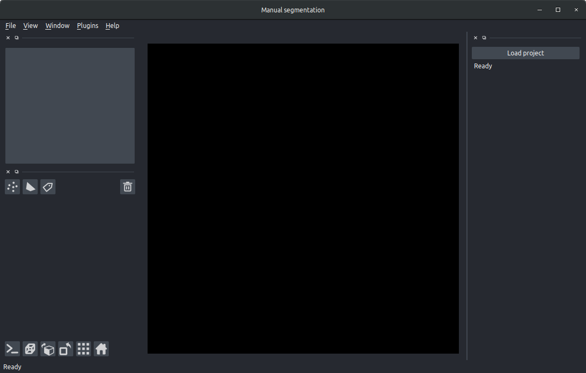
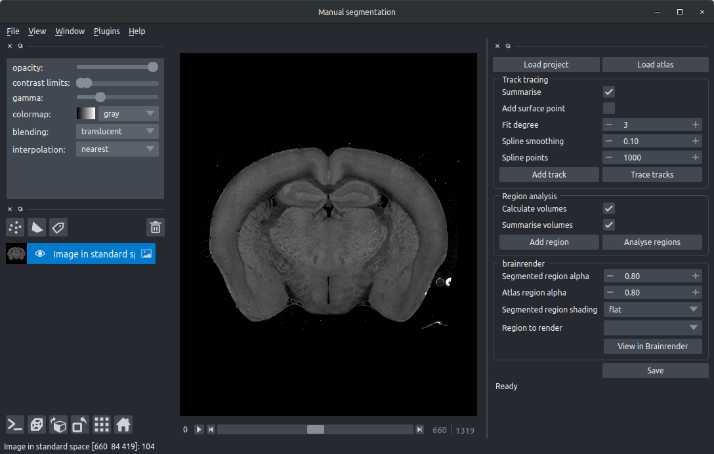

# Manually segment in standard space

To manually segment brain regions and tracks in standard space that can then be visualised along with other samples \(e.g. in [BrainRender](https://github.com/BrancoLab/BrainRender).\)


This tool is in development, and so the interface may change at any point. Currently it is only available by installing the neuro pre-release version \(`pip install neuro --upgrade --pre`\)



For now, this tool depends on [amap](https://github.com/SainsburyWellcomeCentre/amap). Please run `pip install amap` and then `amap_download` before running this tool if you don't already have cellfinder installed


### Prerequisites

Data must be registered to a standard atlas \(currently only the [Allen Reference Atlas](http://mouse.brain-map.org/) is supported\) using [amap](https://github.com/SainsburyWellcomeCentre/amap-python) \(or the amap based registration in [cellfinder](https://github.com/SainsburyWellcomeCentre/cellfinder)\). Please follow the instructions for these packages, and ensure that the channel that you want to segment is downsampled \(e.g. using the `--downsample` flag in amap\).

## Usage

### Command line

```bash
    manual_seg
```

Run `manual_seg` and a GUI will open:



Click `Load project` and choose the downsampled image \(in the registration output directory\) you would like to segment.

manual\_seg will transform your image into standard space \(this may take a few minutes\) and then display the image in a [napari](https://github.com/napari/napari) viewer:




If you rename anything in the viewer \(a track, region etc.\), ensure that there are no spaces in the name. Use an underscore \(`_`\) instead.


### **Navigating**

In the window that opens, by default, only one image will be opened \(your image in standard space\).  

You can navigate around the volume:

* Use the scroll bar at the bottom \(or left/right keys\) to navigate through the image stack
* Use the mouse scrollwheel to zoom in or out
* Drag with the mouse the pan the view

You can adjust the view of your image, by selecting its "layer" in the sidebar \(click on `Image in standard space`\), there you can change the gamma enhancement, contrast limits \(right click for finer control\) and the colormap used.

The buttons directly below the layers can be used to rotate the data, reset the view and view in 3D etc \(this may be slow as the entire volume will need to be loaded into memory\).

### To trace a  linear track

* Click the `Add track` button
* If required, rename the track \(by selecting the `track_0` text\)
* Navigate to where you want to draw your region of interest.
* Make sure the add points mode is activated \(by selecting the `+` symbol\)
* Trace your track by adding points along it. You can add as many, or as few as you like, and this can be done in 3D by changing the viewer plane as you go along.
* Repeat the above for each track you wish to trace
* Save the tracks `Save` making sure that the terminal window shows that the saving has completed.
* The points can then be joined using spline interpolation by clicking `Trace tracks`. You can change:
  * `Fit degree`- what order spline fit to use \(the default is 3, cubic\)
  * `Spline smoothing` - how closely or not to fit the points \(lower numbers fit more closely, for a less smooth interpolation\)
  * `Spline points` - this doesn't affect the interpolation, but determines how many points are sampled from the interpolation \(used for the summary\)
  * `Summarise`- defaults to on, this will save a csv file, showing the brain area for each part of the interpolated track \(determined by `Spline points` \)
  * `Add surface point` If the brain surface is damaged, you may not be able to trace perfectly from the surface. Selecting this option will add an additional point at the closest part of the brain surface to the first point, so that the track starts there.
* Once the tracks are extracted, the fits will be overlaid on the image, but you can preview them in 3D in brainrender \(see below\). 

### To segment regions

* Click the `Add region` buttons
* If required, rename this region \(by selecting the e.g. `region_0` text\)
* Navigate to where you want to draw your region of interest.
* Choose a brush size \(top left box\)
* Make sure painting mode is activated \(by selecting the paintbrush, top left\). You can 

  go back to the navigation mode by selecting the magnifying glass.

* Colour in your region that you want to segment, ensuring that you make a 

  solid object. 

* Selecting the `ndim` toggle in the top left will extend the brush size in three dimensions \(so it will colour in multiple layers\).
* Add a new region if required \(`Add region`\)
* Repeat above for each region you wish to segment.
* Save the regions `Save` making sure that the terminal window shows that the saving has completed.
* Click `Analyse regions` to analyse the spatial distribution of the regions you have drawn. 
  * If `Calculate volumes` is selected,  the volume of each brain area included in the segmented region will be calculated and saved.
  * If `Summarise volumes` is selected, then each region will be summarised \(centers, volumes etc\)

**Editing regions:**

If you have already run `manual_seg`, and run it again, the segmented regions will be shown. You can edit them, and click `Save` to resave them.

### **Previewing in brainrender**

Segmented regions \(once saved\) can be previewed in brainrender in 3D. Simply click on `View in brainrender`.  There are a number of options you can change:

* `Segmented region alpha` Transparency of the regions you have manually drawn
* `Atlas region alpha` Transparency of the brain regions rendered
* `Region to render` Optional atlas brain regions to render in addition to the manually drawn regions
* `Segmented region shading` Shading type for the regions you have segmented, choose from `flat`, `giroud` or `phong.`

